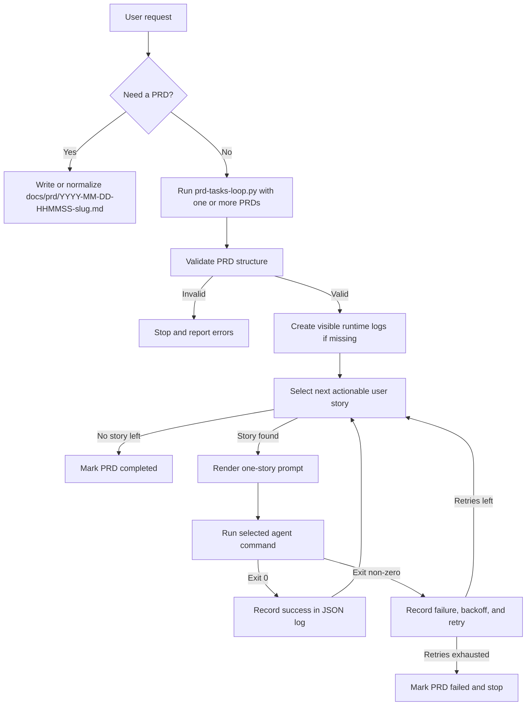

# Workflow

This document describes the simplified `prd-tasks-loop` workflow.

## High-Level Flow

## State Files

For a PRD named `docs/prd/2026-04-30-104512-jwt-authentication.md`, the runner writes:

- `docs/prd/2026-04-30-104512-jwt-authentication.json.log`
- `docs/prd/2026-04-30-104512-jwt-authentication.progress.log`

The JSON log is the machine-readable source of truth.

The progress log is append-only operator output.

## Operator Rules

- validate PRDs before running them
- keep PRD names stable after execution starts
- do not edit runtime logs by hand
- prefer CLI flags when you need temporary runtime overrides
- expect the runner to stop on the first incomplete or failed PRD
